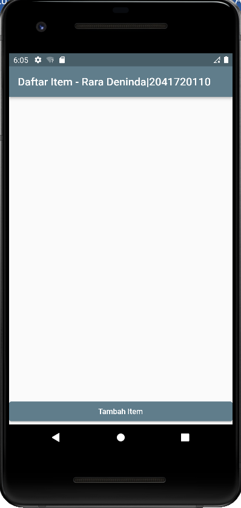
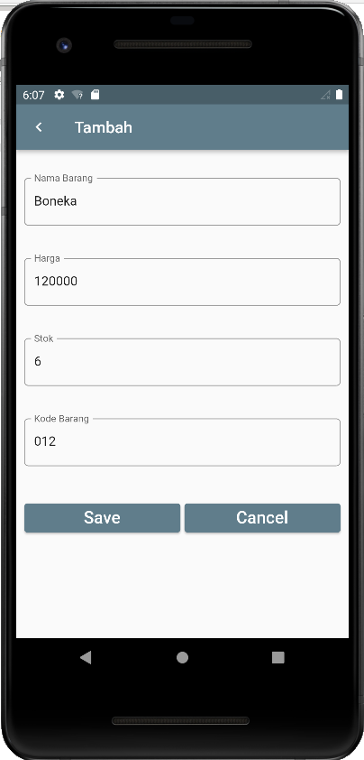

# flutter_sqlite
NAMA: Rara Deninda Hurianto  
KELAS: TI 3C  
NIM: 2041720110  
## 1. Tampilan awal

 
 

## 2. Menambah data

 
 

## 3. Data berhasil ditambahkan

 
 

## 4. Mengedit data

 
 

## 5. Data berhasil di update

 
 

## 6. Menghapus data

 
 